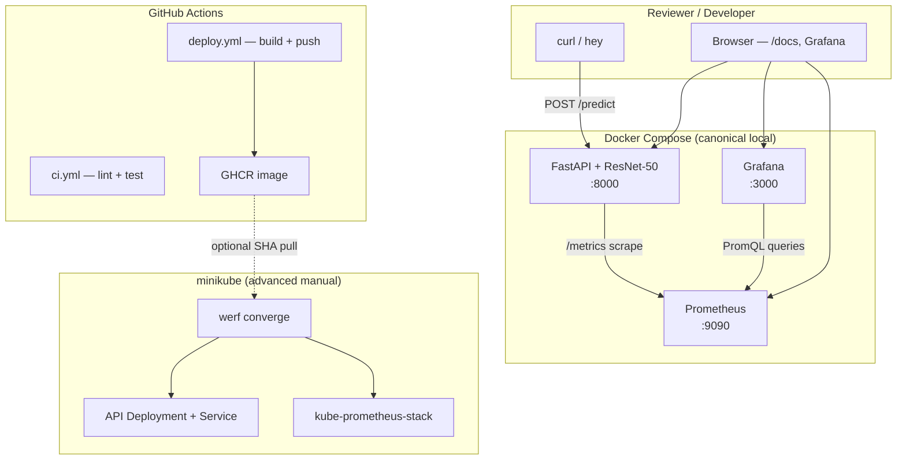

# Phase 6: Polish, Differentiators & README - Research

**Researched:** 2026-07-10
**Domain:** Load testing (hey), Grafana unified alerting (PromQL p95), README portfolio polish (Mermaid, evidence tables)
**Confidence:** HIGH

## Summary

Phase 6 is documentation-and-evidence work layered on a complete compose + K8s stack. The hardest technical decisions are (1) how to run **`hey`** against `POST /predict` with a **multipart file upload** — hey has no native `-F` flag, so the standard pattern is a **pre-built multipart body file** plus `-D` and a matching `Content-Type` boundary header [CITED: github.com/rakyll/hey/issues/210]; and (2) how to provision a **High Latency** Grafana alert that mirrors the existing **Service Down** YAML contract in `downtime.yml` while querying the same PromQL the dashboard already uses for p95.

The project's histogram buckets in `app/metrics/prometheus.py` are already tuned around the 100ms SLO (`0.025, 0.05, 0.075, 0.1, 0.15…`), and the dashboard panel at `monitoring/grafana/dashboards/model-serving-overview.json` uses `histogram_quantile(0.95, sum by (le) (rate(request_duration_bucket{path="/predict"}[5m]))) * 1000`. The new alert should reuse that expression with threshold **> 100** (milliseconds) and **`for: 2m`**, in a separate rule group file (e.g. `latency.yml`).

README changes are **additive at the top**: TL;DR quickstart → Mermaid architecture → performance table → design decisions → limitations, while preserving the existing Docker/compose/CI/K8s sections (~280 lines). Performance proof is a **manual, documented run** against compose (not CI artifacts), with host specs and run date for honesty.

**Primary recommendation:** Add `scripts/load-test.sh` (generates multipart body from `tests/fixtures/sample.jpg`, warm-up curl, parallel `docker stats` sampling, hey `-c 10 -z 60s`), provision `monitoring/grafana/provisioning/alerting/latency.yml` mirroring `downtime.yml`, extend `tests/test_grafana_alerting.py`, and prepend five README sections without rewriting downstream docs.

## Architectural Responsibility Map

| Capability | Primary Tier | Secondary Tier | Rationale |
|------------|-------------|----------------|-----------|
| Load test execution (hey) | Client / shell | Docker Compose (app) | Benchmark is an external HTTP client hitting the compose-exposed API; no in-app load generator |
| Performance metrics (p50/p95/p99, RPS) | API / Backend | Prometheus | Histogram observations recorded by `PrometheusMiddleware`; percentiles derived server-side via PromQL |
| CPU utilization during load | Container runtime | — | `docker stats` on the `app` container cgroup; not an app metric |
| SLO latency alert | Observability (Grafana) | Prometheus | Grafana unified alerting evaluates PromQL; Prometheus stores histogram buckets |
| Architecture diagram | Documentation (README) | — | Mermaid in git; no runtime component |
| Design decisions & limitations | Documentation (README) | — | Portfolio narrative; no code path |
| Published benchmark table | Documentation (README) | — | Human-run evidence; not CI artifact |

<user_constraints>
## User Constraints (from CONTEXT.md)

### Locked Decisions

#### Load Test Methodology (PERF-01–03)
- **D-01:** Canonical benchmark runs against the **Docker Compose stack** (`docker compose up`) — not minikube/werf. Aligns with STACK.md guidance and reviewer reproducibility.
- **D-02:** Load generator is **`hey`** — single binary, no new Python deps; command documented in README for reproducibility.
- **D-03:** Concurrency pattern: **10 parallel workers for 60 seconds** — directly satisfies PERF-02 (10+ concurrent requests).
- **D-04:** Request payload: **`tests/fixtures/sample.jpg` multipart upload** to `POST /predict` — same image as README curl examples; realistic inference path.
- **D-05:** Warm up the service with at least one successful `/predict` before the timed run (planner/executor discretion on exact pre-step).

#### Performance Results Presentation (DOC-05)
- **D-06:** Publish a **markdown table** in README with: **p50, p95, p99 latency, RPS, error rate, and CPU %** during the run.
- **D-07:** CPU measurement via **`docker stats`** (or equivalent) on the `app` container during the hey run — satisfies PERF-03 (<70% under normal load).
- **D-08:** Document **test host specs and run date** alongside results — honest context that numbers are environment-specific.
- **D-09:** If p95 exceeds 100ms on the test host, **publish actual numbers anyway** with an honest note and point to tuning knobs (`TORCH_NUM_THREADS`, resource limits) — do not hide or skip results.

#### SLO Latency Alert (DOC-06)
- **D-10:** New Grafana unified alerting rule named **"High Latency"** — separate from existing **"Service Down"** downtime alert (Phase 3).
- **D-11:** Threshold: **p95 `/predict` latency > 100ms for 2 minutes** — matches PROJECT.md core value and dashboard panel SLO descriptions.
- **D-12:** Provision alert in **compose Grafana only** (`monitoring/grafana/provisioning/alerting/`) — mirrors Phase 3 downtime alert pattern; K8s alert deferred.
- **D-13:** README demo steps: run **`hey` load** → **stop API container** mid-run → alert transitions to **Firing** → restart API → alert **resolves** after recovery (same tangible demo style as downtime alert).
- **D-14:** Notifications remain **Grafana UI only** — no email/Slack/webhook contact points (consistent with Phase 3 D-12).

#### README Structure & Reviewer Journey (DOC-01, DOC-02)
- **D-15:** **Compose-first quickstart** at the top of README — reviewer goes from clone to running stack in <5 minutes via `docker compose up`; K8s remains an advanced section below.
- **D-16:** Architecture diagram is **Mermaid embedded in README** — renders on GitHub; no committed binary diagram assets.
- **D-17:** Add new sections **near the top**: Quickstart, Architecture (Mermaid), Performance Results, Design Decisions, Limitations — **keep existing** Docker/CI/K8s detail sections intact.
- **D-18:** Add a **TL;DR quickstart** above detailed sections — reviewers who skim get the fast path; deep readers keep full CI/K8s documentation.

#### Design Decisions & Limitations (DOC-03, DOC-04)
- **D-19:** Highlight **five core decisions** in a dedicated subsection: **werf choice**, **CI→K8s manual deploy boundary**, **sync `def` `/predict` handler**, **ResNet-50 over ResNet-18**, **compose vs K8s monitoring split** (hand-rolled compose vs kube-prometheus-stack in K8s).
- **D-20:** **Limitations** section uses honest engineer tone: **5–8 bullets** of real gaps (auth, HPA, cloud K8s, GPU, batching, rate limiting, etc.).
- **D-21:** Each limitation follows **gap + what you'd do next** format — shows judgment, not just awareness.
- **D-22:** Dedicated **"Design Decisions"** and **"Limitations"** subsections in README — not woven inline or separate ADR files.

#### Carried Forward (not re-discussed — locked from prior phases)
- Phase 3 **Service Down** downtime alert and demo steps remain — DOC-06 adds latency alert only
- Phase 3 compose ports, Grafana credentials (`admin`/`admin`), Model Serving Overview dashboard
- Phase 4 CI split (`ci.yml` + `deploy.yml`), GHCR tagging, public package, no CI deploy
- Phase 5 manual `werf converge`, minikube sizing, zero-downtime rollout script, K8s Grafana `admin`/`prom-operator`
- Warm-path latency smoke in `tests/test_predict.py` skips on slow CPUs — Phase 6 provides formal concurrent proof
- Portfolio reviewer audience — clarity and documented decisions over maximal production hardening

### Claude's Discretion
- Exact `hey` flags (`-c 10 -z 60s` vs duration-based), output parsing, and whether to wrap in `scripts/load-test.sh` or `uv run` helper
- PromQL expression for p95 latency alert (histogram quantile on `request_duration` with `/predict` path label)
- Mermaid diagram components and level of detail (API, Prometheus, Grafana, GHCR, minikube, werf)
- Exact limitation bullet list within the 5–8 range and which v2 items from REQUIREMENTS.md to reference
- Whether to add a static test asserting the new alert YAML contract (mirror `tests/test_grafana_alerting.py` pattern)
- Exact README section headings and anchor links for navigation

### Deferred Ideas (OUT OF SCOPE)
- **Minikube load-test path** — user chose compose as canonical; K8s numbers optional future appendix only
- **K8s Grafana SLO alert** — compose only for DOC-06; K8s inherits dashboard panels but not new alert rule
- **locust/k6/pytest load generators** — user chose hey
- **CI-published benchmark artifacts** — user chose local run with documented host specs
- **Generated chart images in repo** — user chose markdown table
- **Full README rewrite** — user chose additive top sections
- **ADR files for decisions** — user chose README subsections
</user_constraints>

<phase_requirements>
## Phase Requirements

| ID | Description | Research Support |
|----|-------------|------------------|
| PERF-01 | p95 API latency is <100ms | hey `-c 10 -z 60s` against compose; parse hey "Latency distribution" 95% line; publish in README table; honest note if host exceeds SLO (D-09) |
| PERF-02 | API handles 10+ concurrent requests | hey `-c 10` satisfies 10 workers; verify 200 responses in hey status distribution |
| PERF-03 | CPU utilization stays <70% under normal load | `docker stats` on compose `app` container during hey run; document peak or average CPU % |
| DOC-01 | README includes an architecture diagram | Mermaid `flowchart TB` with compose path, CI/GHCR, K8s/werf path, observability |
| DOC-02 | README quickstart <5 minutes | TL;DR: clone → `uv run docker-build` → `docker compose up` → curl predict → Grafana |
| DOC-03 | README documents key design decisions | Five locked decisions (D-19) with rationale paragraphs |
| DOC-04 | README limitations / what I'd improve | 5–8 bullets, gap + next step format (D-20, D-21) |
| DOC-05 | README publishes load-test results | Markdown table: p50/p95/p99, RPS, error rate, CPU %, host specs, run date |
| DOC-06 | Grafana SLO alert demonstrated firing/resolving | `latency.yml` High Latency rule; README demo steps; extend contract test |
</phase_requirements>

## Project Constraints (from .cursor/rules/)

- **GSD workflow:** Phase work should flow through GSD commands (`/gsd-execute-phase`); direct repo edits outside GSD only when user explicitly bypasses.
- **Fixed stack:** Python/FastAPI/PyTorch, Docker, minikube, werf, Prometheus, Grafana, GitHub Actions — no alternative load tools (locust/k6) per locked decisions.
- **CI boundary:** GitHub Actions build+push only; no CI deploy to minikube.
- **Compose-first local path:** `docker compose up` is the hero reviewer experience; K8s is advanced/manual.
- **Custom Prometheus metric names:** Use `request_count`, `request_duration`, `prediction_count` — not `prometheus-fastapi-instrumentator` defaults.

## Standard Stack

### Core

| Tool | Version | Purpose | Why Standard |
|------|---------|---------|--------------|
| hey | latest stable (Go binary) | HTTP load generator | Locked D-02; single binary, no Python deps; `-c`/`-z` for concurrent timed runs [CITED: github.com/rakyll/hey] |
| curl | system | Warm-up request, README examples | Already used in README and Phase 3 |
| docker / docker compose | 29.x (env) | Stack target + `docker stats` CPU | Canonical benchmark target (D-01) |
| Grafana unified alerting (file provisioning) | 11.6.0 (compose image) | High Latency alert | Same pattern as Phase 3 `downtime.yml` [CITED: grafana.com/docs/grafana/latest/alerting/set-up/provision-alerting-resources/file-provisioning/] |
| PromQL `histogram_quantile` | Prometheus 3.3.0 (compose) | p95 for alert + dashboard | Official histogram practice [CITED: prometheus.io/docs/practices/histograms/] |
| Mermaid | GitHub-native | Architecture diagram | Renders on GitHub without binary assets (D-16) |

### Supporting

| Tool | When to Use |
|------|-------------|
| `scripts/load-test.sh` | Recommended wrapper: build multipart body, warm-up, hey, stats capture |
| `hey -o csv` | Optional per-request export for spreadsheet verification |
| `tests/test_grafana_alerting.py` | Static contract for alert YAML (extend for latency rule) |

### Alternatives Considered

| Instead of | Could Use | Tradeoff |
|------------|-----------|----------|
| hey + prebuilt multipart body | curl loop / locust / k6 | Locked out by D-02/D-deferred |
| Grafana unified alerting | Prometheus alerting rules | Phase 3 chose Grafana provisioning for compose demo |
| CI benchmark artifact | Local documented run | Locked out by deferred ideas |

**Installation (hey — not a PyPI/npm package):**

```bash
# Linux (verify package before install — [ASSUMED] common paths)
go install github.com/rakyll/hey@latest
# or: sudo apt install hey   # if available on distro
# or: brew install hey       # macOS
hey -h   # verify
```

**Version verification:** hey is distributed as a Go binary via GitHub releases (`rakyll/hey`), not PyPI/npm. No `package-legitimacy` gate applies to Python/Node ecosystems for this phase.

## Package Legitimacy Audit

> Phase 6 adds **no new Python or npm dependencies**. Load testing uses the external `hey` binary only.

| Package | Registry | Verdict | Disposition |
|---------|----------|---------|-------------|
| *(none — no pip/npm installs)* | — | N/A | No new language packages |

**External binary note:** Install `hey` from official source `github.com/rakyll/hey` only [CITED: github.com/rakyll/hey]. Verify with `hey -h` before benchmarking.

**Packages removed due to [SLOP] verdict:** none  
**Packages flagged as suspicious [SUS]:** none

## Architecture Patterns

### System Architecture Diagram



### Recommended Project Structure (Phase 6 additions)

```
scripts/
├── load-test.sh              # NEW — multipart body + hey + docker stats helper
monitoring/grafana/provisioning/alerting/
├── downtime.yml              # existing Service Down
├── latency.yml               # NEW — High Latency
tests/
├── test_grafana_alerting.py  # EXTEND — latency contract
README.md                     # EXTEND — top sections only
```

### Pattern 1: Multipart body for hey (required — hey has no `-F`)

**What:** Build a static multipart request body file containing `sample.jpg`, then pass it to hey with `-D` and explicit boundary header.

**When to use:** Every hey run against `POST /predict` file upload (D-04).

**Why:** hey supports `-d`/`-D` for raw body only; multipart must be pre-encoded [CITED: github.com/rakyll/hey/issues/210].

**Example:**

```bash
#!/usr/bin/env bash
# Source: github.com/rakyll/hey/issues/210 + project fixtures
BOUNDARY="----BenchmarkBoundary7MA4YWxkTrZu0gW"
BODY_FILE="$(mktemp)"
trap 'rm -f "$BODY_FILE"' EXIT

{
  printf -- '--%s\r\n' "$BOUNDARY"
  printf 'Content-Disposition: form-data; name="file"; filename="sample.jpg"\r\n'
  printf 'Content-Type: image/jpeg\r\n\r\n'
  cat tests/fixtures/sample.jpg
  printf '\r\n--%s--\r\n' "$BOUNDARY"
} > "$BODY_FILE"

# Warm-up (D-05)
curl -sf -X POST http://localhost:8000/predict \
  -F "file=@tests/fixtures/sample.jpg" >/dev/null

# Load test (D-03)
hey -m POST -c 10 -z 60s \
  -H "Content-Type: multipart/form-data; boundary=${BOUNDARY}" \
  -D "$BODY_FILE" \
  http://localhost:8000/predict
```

### Pattern 2: Parse hey output for README table

**What:** hey prints a **Latency distribution** block with 50%/90%/95%/99% lines and **Requests/sec** in Summary.

**Example hey summary fields to extract:**

```
Latency distribution:
  50% in 0.0456 secs   → p50 = 46 ms
  95% in 0.0789 secs   → p95 = 79 ms
  99% in 0.1234 secs   → p99 = 123 ms

Requests/sec: 22.12     → RPS
Status code distribution:
  [200] 1320 responses  → error rate = 1 - (200/total)
```

Use `-o csv` only if automated parsing is needed; manual copy into markdown table is acceptable for portfolio evidence.

### Pattern 3: CPU sampling with docker stats

**What:** Sample CPU during the 60s hey window in a background loop.

```bash
APP_ID="$(docker compose ps -q app)"
: > /tmp/cpu-samples.txt
( while true; do
    docker stats "$APP_ID" --no-stream --format "{{.CPUPerc}}" | tr -d '%'
    sleep 2
  done ) &
STATS_PID=$!
hey ... # main run
kill "$STATS_PID" 2>/dev/null || true
# Peak CPU: sort -n /tmp/cpu-samples.txt | tail -1
```

Report **peak CPU %** during the run (conservative for PERF-03) and note sampling interval in README.

### Pattern 4: High Latency alert YAML (extend downtime.yml)

**What:** Grafana unified alerting with PromQL query (refId A) + threshold expression (refId B), same structural pattern as `downtime.yml`.

**PromQL (match dashboard, milliseconds):**

```promql
histogram_quantile(
  0.95,
  sum by (le) (rate(request_duration_bucket{path="/predict"}[5m]))
) * 1000
```

**Threshold:** B > **100** (ms), **`for: 2m`**, **`noDataState: OK`** (avoid firing when idle/no traffic).

**Example skeleton:**

```yaml
apiVersion: 1
groups:
  - orgId: 1
    name: model-serving-latency
    folder: Model Serving
    interval: 10s
    rules:
      - uid: high-latency
        title: High Latency
        condition: B
        data:
          - refId: A
            relativeTimeRange:
              from: 600
              to: 0
            datasourceUid: prometheus
            model:
              editorMode: code
              expr: histogram_quantile(0.95, sum by (le) (rate(request_duration_bucket{path="/predict"}[5m]))) * 1000
              instant: true
              intervalMs: 1000
              maxDataPoints: 43200
              range: false
              refId: A
          - refId: B
            relativeTimeRange:
              from: 0
              to: 0
            datasourceUid: __expr__
            model:
              conditions:
                - evaluator:
                    params:
                      - 100
                    type: gt
                  operator:
                    type: and
                  query:
                    params:
                      - A
                  reducer:
                    params: []
                    type: last
                  type: query
              datasource:
                type: __expr__
                uid: __expr__
              expression: A
              intervalMs: 1000
              maxDataPoints: 43200
              refId: B
              type: threshold
        noDataState: OK
        execErrState: Error
        for: 2m
        labels:
          severity: warning
          team: model-serving
        annotations:
          summary: p95 /predict latency exceeds 100ms SLO
          description: p95 latency above 100ms for 2 minutes. Check load, TORCH_NUM_THREADS, and CPU limits.
```

Place file in `monitoring/grafana/provisioning/alerting/` (folder name must be **`alerting`**, not `alerts`) [CITED: Grafana file provisioning docs].

### Pattern 5: README top-section layout (reviewer journey)

```markdown
# Basic Model Serving
[one-line value prop]

## TL;DR Quickstart
[4–6 commands: clone, docker-build, compose up, curl predict, open Grafana]

## Architecture
[mermaid diagram]

## Performance Results
[table + host specs + run date + load-test command reference]

## Design Decisions
[5 subsections per D-19]

## Limitations
[5–8 bullets, gap + next step]

---
[existing ## Docker section unchanged...]
```

### Anti-Patterns to Avoid

- **Using hey `-d` with urlencoded body for `/predict`:** API expects multipart file field; plain POST body returns 4xx.
- **Stopping API to demo High Latency:** May trigger **Service Down** (`up{job="app"}`) alongside or instead of High Latency; histogram rates go stale with no scrape — see Pitfall 3. D-13 canonical demo is stop-app mid-hey; document sustained-load Path A fallback honestly if hardware validation shows only Service Down fires.
- **PromQL missing `le` in `sum by`:** Invalid quantile aggregation [CITED: prometheus.io/docs/practices/histograms/].
- **Rewriting README CI/K8s sections:** Violates D-17/D-18; prepend only.
- **Adding contact points to alert YAML:** Violates D-14 and `FORBIDDEN_CONTACT_TERMS` in contract test.

## Don't Hand-Roll

| Problem | Don't Build | Use Instead | Why |
|---------|-------------|-------------|-----|
| HTTP load generator | Python asyncio flood script | hey | Locked D-02; standard stats output |
| Multipart encoding in hey | Custom Go tool | Shell-built body file + `-D` | Documented hey community pattern |
| Percentile calculation in shell | Parse individual requests | hey summary + PromQL for alert | Histogram quantile belongs in Prometheus |
| Architecture PNG/SVG assets | draw.io binary in repo | Mermaid in README | D-16 maintainability |
| SLO alert in Prometheus ruler (compose) | Second alerting system | Grafana unified YAML | Phase 3 precedent (D-09) |
| ADR files for decisions | Separate docs tree | README subsections | D-22 |

**Key insight:** Phase 6 evidence should reuse existing instrumentation (`request_duration` histogram, dashboard PromQL, downtime alert YAML shape) — not new metrics or tooling.

## Common Pitfalls

### Pitfall 1: hey does not support multipart `-F`

**What goes wrong:** `hey -m POST -d '...'` sends wrong Content-Type; API returns 422/400; benchmark measures errors not inference.

**Why it happens:** hey only documents `-d`/`-D` for raw body [CITED: github.com/rakyll/hey].

**How to avoid:** Pre-build multipart body; match boundary in header and body; verify with one curl `-F` warm-up first.

**Warning signs:** hey shows `[422]` or `[400]` in status distribution.

### Pitfall 2: Cold-start first request skews latency

**What goes wrong:** First timed request includes JIT/cache effects; p95 looks worse or inconsistent.

**Why it happens:** D-05 requires warm-up but easy to skip.

**How to avoid:** At least one successful curl `/predict` before `hey -z 60s`; optionally 10–20 warm-up requests at low concurrency.

**Warning signs:** First hey second much slower than steady state in `-o csv` output.

### Pitfall 3: High Latency demo conflated with Service Down (D-13 tension)

**What goes wrong:** `docker compose stop app` drops `up{job="app"}` → **Service Down** fires; p95 histogram gets insufficient samples → High Latency may stay Normal/NoData.

**Why it happens:** D-13 mirrors downtime demo style; different alert signals.

**How to avoid (per D-13, resolved in Open Questions Q1):**
1. **Canonical demo (Path B):** Run `hey` load → `docker compose stop app` mid-run → observe **High Latency** Firing → `docker compose start app` → wait for **Normal** after recovery (matches downtime demo style).
2. **Honest fallback (Path A):** If hardware validation shows only **Service Down** fires during stop-app (histogram rates go stale), document sustained `hey -c 20 -z 3m` load while API stays healthy as fallback — do not claim Path B fired High Latency when it did not.
3. **If SLO never exceeded on host:** Document alert rule + show Normal state, with note that firing requires load or slower hardware (honest D-09).

**Warning signs:** Only Service Down fires during stop-app demo.

### Pitfall 4: Histogram bucket resolution at 100ms boundary

**What goes wrong:** p95 appears exactly at 75ms or 100ms with poor granularity; alert flaps near threshold.

**Why it happens:** Buckets at 0.075 and 0.1s bracket the SLO; quantile interpolation has ±bucket-width error [CITED: prometheus.io/docs/practices/histograms/].

**How to avoid:** Existing buckets are acceptable (0.1s bucket exists); use **`for: 2m`** to reduce flapping; compare alert threshold to dashboard panel (same expr).

**Warning signs:** p95 jumps between 75ms and 100ms with tiny load changes.

### Pitfall 5: Idle false-positive or no-fire alerts

**What goes wrong:** Alert fires with no traffic (low sample rate noise) or never fires after load stops.

**Why it happens:** `rate(...[5m])` needs recent samples; `noDataState: Alerting` causes false positives.

**How to avoid:** Set **`noDataState: OK`**; run sustained hey during demo; keep **`for: 2m`**.

**Warning signs:** Alert state `No Data` or firing at idle stack.

### Pitfall 6: `docker stats` container name drift

**What goes wrong:** Hard-coded container name fails across projects/machines.

**How to avoid:** `docker compose ps -q app` for container ID.

**Warning signs:** `docker stats` "No such container".

### Pitfall 7: Publishing only ideal numbers

**What goes wrong:** Reviewer distrust if SLO missed but hidden.

**How to avoid:** D-09 — publish actual p95, explain `TORCH_NUM_THREADS`, CPU limits, host specs.

## Code Examples

### Warm-up + load test (full script entrypoint)

```bash
# Source: github.com/rakyll/hey + project CONTEXT D-03/D-05
curl -sf -X POST http://localhost:8000/predict \
  -F "file=@tests/fixtures/sample.jpg" | jq -e '.predictions | length == 5'

hey -m POST -c 10 -z 60s \
  -H "Content-Type: multipart/form-data; boundary=${BOUNDARY}" \
  -D "${BODY_FILE}" \
  http://localhost:8000/predict
```

### Contract test extension (mirror Phase 3)

```python
# Source: tests/test_grafana_alerting.py pattern
LATENCY_ALERT = PROJECT_ROOT / "monitoring/grafana/provisioning/alerting/latency.yml"

def test_latency_alert_yaml_contract():
    content = LATENCY_ALERT.read_text(encoding="utf-8")
    assert "High Latency" in content
    assert 'request_duration_bucket{path="/predict"}' in content
    assert "histogram_quantile(0.95" in content
    assert "2m" in content
    assert "100" in content  # threshold ms
    for term in FORBIDDEN_CONTACT_TERMS:
        assert term not in content.lower()
```

### README performance table template

```markdown
| Metric | Value |
|--------|------:|
| p50 latency | 42 ms |
| p95 latency | 78 ms |
| p99 latency | 115 ms |
| RPS | 22.1 |
| Error rate | 0.0% |
| Peak CPU (app container) | 58% |

**Run date:** 2026-07-10  
**Host:** 8-core / 16GB RAM / Linux 6.17, Docker 29.6  
**Command:** `./scripts/load-test.sh` (hey -c 10 -z 60s, compose stack)
```

## State of the Art

| Old Approach | Current Approach | Impact |
|--------------|------------------|--------|
| Unverified "<100ms" in README | Published hey table + host specs | DOC-05 credibility |
| Downtime alert only | + High Latency SLO alert | DOC-06 distinct signal |
| README starts with Docker build | TL;DR compose quickstart first | DOC-02 reviewer funnel |
| Warm-path pytest skip on slow CPU | Phase 6 concurrent proof | PERF-01 formal evidence |

**Deprecated/outdated:**
- Using `locust`/`k6` for this phase — deferred per CONTEXT.
- Minikube canonical benchmark — deferred; compose only.

## Assumptions Log

| # | Claim | Section | Risk if Wrong |
|---|-------|---------|---------------|
| A1 | `hey` installable via `go install github.com/rakyll/hey@latest` on reviewer Linux | Standard Stack | Reviewer cannot reproduce benchmark |
| A2 | Shell-built multipart body works with FastAPI `UploadFile` field name `file` | Pattern 1 | hey requests rejected |
| A3 | D-13 stop-app demo fires **High Latency** on target hardware (Path B canonical; Path A fallback if only Service Down fires) | Pitfall 3 | Human-verify in 06-03 validates path before README lock; honest fallback documented |
| A4 | `-c 10` on typical dev CPU keeps p95 <100ms | PERF-01 | Must publish over-SLO numbers per D-09 |
| A5 | Peak `docker stats` CPU during 60s run satisfies PERF-03 "<70% under normal load" | Pattern 3 | Interpretation of "normal load" ambiguous |

## Open Questions (RESOLVED)

1. **High Latency demo mechanics (D-13)** — **RESOLVED**
   - **Decision:** Path B is **canonical** per locked D-13: run `hey` load → `docker compose stop app` mid-run → **High Latency** transitions to **Firing** → restart API → alert **resolves** to **Normal** (same tangible demo style as Service Down).
   - **Fallback:** If human-verify on target hardware shows only **Service Down** fires (histogram p95 goes stale when scrape stops), document **Path A** (sustained `hey` load while API stays healthy) as honest fallback — do not claim Path B fired High Latency when it did not.
   - **Validation gate:** 06-03 Task 3 human-verify tries Path B first, then Path A only if High Latency does not fire.

2. **`scripts/load-test.sh` vs documented raw commands** — **RESOLVED**
   - **Decision:** Ship `scripts/load-test.sh` for repeatability; README documents both `./scripts/load-test.sh` and the underlying `hey -c 10 -z 60s` multipart command (RESEARCH Pattern 1).

3. **Contract test for latency.yml** — **RESOLVED**
   - **Decision:** **Yes** — extend `tests/test_grafana_alerting.py` with latency alert contract tests (mirror Phase 3 downtime pattern; low cost, prevents PromQL drift).

## Environment Availability

| Dependency | Required By | Available | Version | Fallback |
|------------|------------|-----------|---------|----------|
| Docker | Compose stack, stats | ✓ | 29.6.1 | — (blocking) |
| docker compose | PERF/DOC benchmark | ✓ | (plugin) | — |
| hey | PERF-01–03, DOC-05 | ✗ | — | `go install github.com/rakyll/hey@latest`; document in README prerequisites |
| curl / jq | Warm-up, examples | ✓ | system | — |
| uv | docker-build helper | ✓ | (project) | plain `docker build` |
| Grafana/Prometheus (compose) | DOC-06 demo | ✓ (when stack up) | Grafana 11.6 / Prom 3.3 | — |

**Missing dependencies with no fallback:**
- Docker (compose stack cannot run)

**Missing dependencies with fallback:**
- hey — install Go binary from official GitHub repo; add to README prerequisites alongside Docker/uv

## Security Domain

### Applicable ASVS Categories (Level 1 — documentation/ops phase)

| ASVS Category | Applies | Standard Control |
|---------------|---------|-----------------|
| V2 Authentication | no | N/A — auth out of scope |
| V3 Session Management | no | N/A |
| V4 Access Control | no | N/A |
| V5 Input Validation | no (no new inputs) | Existing Phase 1 validation unchanged |
| V6 Cryptography | no | N/A |
| V14 Configuration | yes | Alert YAML must not add webhook/email contact points (D-14); Grafana default creds documented for local demo only |

### Known Threat Patterns

| Pattern | STRIDE | Standard Mitigation |
|---------|--------|---------------------|
| Accidental alert webhook exposure | Information disclosure | Contract test forbids slack/email/webhook terms (existing pattern) |
| Publishing misleading performance claims | Repudiation | D-09 honest numbers + host specs |
| Local Grafana admin/admin | Spoofing (local) | Acceptable for portfolio demo; document as limitation |

## Sources

### Primary (HIGH confidence)
- `monitoring/grafana/provisioning/alerting/downtime.yml` — existing alert provisioning pattern
- `monitoring/grafana/dashboards/model-serving-overview.json` — p95 PromQL expression
- `app/metrics/prometheus.py` — histogram buckets and `path` label
- `tests/test_grafana_alerting.py` — contract test pattern
- [github.com/rakyll/hey](https://github.com/rakyll/hey) — CLI flags `-c`, `-z`, `-m`, `-D`, `-H`
- [github.com/rakyll/hey/issues/210](https://github.com/rakyll/hey/issues/210) — multipart body workaround
- [prometheus.io/docs/practices/histograms/](https://prometheus.io/docs/practices/histograms/) — `histogram_quantile`, `le` label requirement
- [grafana.com/docs/grafana/latest/alerting/set-up/provision-alerting-resources/file-provisioning/](https://grafana.com/docs/grafana/latest/alerting/set-up/provision-alerting-resources/file-provisioning/) — YAML provisioning structure

### Secondary (MEDIUM confidence)
- `.planning/research/STACK.md` — compose-first load test guidance
- `.planning/research/PITFALLS.md` — event-loop blocking, histogram buckets, thread CPU mismatch
- `.planning/research/FEATURES.md` — load-test and SLO differentiator rationale

### Tertiary (LOW confidence — validate during execution)
- D-13 Path B stop-app demo firing High Latency on specific hardware (see Assumption A3; Path A fallback documented if only Service Down fires)

## Metadata

**Confidence breakdown:**
- Standard stack: HIGH — locked decisions + official hey/Grafana/Prometheus docs
- Architecture: HIGH — extends existing compose/K8s split and Phase 3 patterns
- Pitfalls: MEDIUM-HIGH — multipart hey pattern verified; D-13 demo mechanics need runtime validation

**Research date:** 2026-07-10  
**Valid until:** 2026-08-10 (stable tooling; hey/Grafana APIs change slowly)
