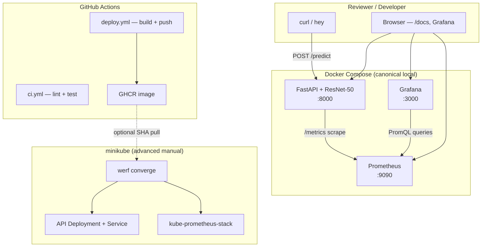

# Basic Model Serving

Portfolio-grade ResNet-50 image classification API with health probes, Prometheus metrics, and structured logging.

## TL;DR Quickstart

Get from clone to a running compose stack in under five minutes.

**Prerequisites:** [Docker](https://docs.docker.com/get-docker/), [uv](https://docs.astral.sh/uv/), and [hey](https://github.com/rakyll/hey) (`go install github.com/rakyll/hey@latest`)

```bash
git clone https://github.com/estevaodr/basic-model-serving.git
cd basic-model-serving
uv run docker-build
docker compose up
```

In another terminal, send a prediction and open Grafana:

```bash
curl -s -X POST http://localhost:8000/predict \
  -F "file=@tests/fixtures/sample.jpg" | jq .
# Grafana dashboards + alerting: http://localhost:3000 (admin / admin)
```

**Next steps:** [Docker](#docker) (single-container run), [Local observability stack](#local-observability-stack) (traffic + alert demos), [Kubernetes](#kubernetes-minikube--werf) (advanced minikube deploy).

## Architecture



## Design Decisions

### werf for local Kubernetes deploys

[werf](https://werf.io/) bundles the API Helm chart and kube-prometheus-stack into a single `werf converge` — one command deploys app + in-cluster monitoring. The user chose werf over vanilla `kubectl apply` / standalone Helm for a portfolio-grade deploy workflow. See [Kubernetes (minikube + werf)](#kubernetes-minikube--werf).

### CI builds and pushes only — manual deploy boundary

GitHub Actions ([`ci.yml`](.github/workflows/ci.yml), [`deploy.yml`](.github/workflows/deploy.yml)) lint, test, and publish images to GHCR on `main` push. Hosted runners cannot reach a local minikube cluster, so **CI does not run `werf converge`**. Deployment is a deliberate manual step from your laptop. See [CI/CD](#cicd).

### Sync `def` `/predict` handler

The `/predict` route uses a plain synchronous `def` handler (not `async def`). PyTorch inference runs on the default thread pool, blocking the event loop during each request. This keeps the inference path simple for a single-worker Uvicorn process; under high concurrency, latency rises as requests queue. See [Performance Results](#performance-results) and `TORCH_NUM_THREADS` tuning below.

### ResNet-50 over ResNet-18

ResNet-50 (ImageNet weights) trades a small latency cost for stronger top-5 accuracy and a standard ImageNet baseline. ResNet-18 would be faster but less representative of a production classification service.

### Compose hand-rolled monitoring vs kube-prometheus-stack in K8s

Local development uses lightweight hand-rolled Prometheus + Grafana in `docker-compose.yml` for fast iteration. Kubernetes deploys bundle [kube-prometheus-stack](https://github.com/prometheus-community/helm-charts/tree/main/charts/kube-prometheus-stack) via werf for Operator-based ServiceMonitor discovery and production-style in-cluster monitoring — same **Model Serving Overview** dashboard, different scrape topology.

## Limitations

- **No API authentication** — `/predict` is open on localhost; add API keys or OAuth behind a gateway for any shared deployment.
- **No horizontal autoscaling (HPA)** — fixed replica count and CPU limits; add HPA on CPU or custom metrics when moving to cloud K8s.
- **Local minikube only** — no EKS/GKE/AKS path in this milestone; cloud would need registry auth, ingress, and cost controls.
- **No GPU inference** — CPU-only PyTorch; GPU would need CUDA base images, device plugins, and different resource limits.
- **No request batching** — one image per request; batching or a dedicated inference server (Triton, TorchServe) would improve throughput under load.
- **No rate limiting** — sustained `hey` load can saturate CPU; add middleware or ingress rate limits before exposing publicly.
- **Grafana default credentials** — compose uses `admin`/`admin`, K8s uses `admin`/`prom-operator`; rotate secrets and disable defaults in production (v2 OBS hardening).
- **CI does not auto-deploy** — merge to `main` publishes GHCR tags only; run `werf converge` manually to update minikube.

---

## Docker

**Prerequisites:** Docker Engine, [uv](https://docs.astral.sh/uv/) (recommended)

### Build

```bash
docker build -t basic-model-serving:local .
# or
uv run docker-build
```

### Run

```bash
docker run --rm -p 8000:8000 basic-model-serving:local
# or
uv run docker-run
```

API: http://127.0.0.1:8000 — docs at `/docs`, metrics at `/metrics`.

### Configuration

Application settings are supplied via environment variables (see `.env.example`):

```bash
docker run --rm -p 8000:8000 \
  -e TORCH_NUM_THREADS=4 \
  -e LOG_LEVEL=DEBUG \
  basic-model-serving:local
```

Copy `.env.example` to `.env` for local non-container runs. Uvicorn host, port, and worker count are fixed in the Dockerfile CMD (`0.0.0.0:8000`, single worker).

### Smoke test

Full E2E verification (build, image size, non-root user, health, predict):

```bash
uv run docker-smoke
```

## Local observability stack

Run the API together with Prometheus and Grafana for live dashboards during development.

**Prerequisites:** Build the app image once before the first compose start:

```bash
uv run docker-build
```

Copy `.env.example` to `.env` if you have not already (compose reads app settings from `.env`).

### Start the stack

```bash
docker compose up
```

| Service | URL | Purpose |
|---------|-----|---------|
| API | http://localhost:8000 | `/predict`, `/docs`, `/metrics` |
| Grafana | http://localhost:3000 | Dashboards and alerting UI |
| Prometheus | http://localhost:9090 | Metrics storage and targets |

Log in to Grafana with `admin` / `admin`. After login you land on the **Model Serving Overview** home dashboard.

### Generate traffic

Send sample predictions so panels populate:

```bash
curl -s -X POST http://localhost:8000/predict \
  -F "file=@tests/fixtures/sample.jpg" | jq .

# Optional 4xx example (non-image upload)
curl -s -X POST http://localhost:8000/predict \
  -F "file=@README.md"
```

### Image-only iteration

After code changes, rebuild and restart only the API container:

```bash
uv run docker-build
docker compose restart app
```

### Alert demo (Service Down)

1. With the stack running, open Grafana → **Alerting** → **Alert rules** and confirm **Service Down** is listed.
2. Stop the API: `docker compose stop app`
3. Wait ~60–90 seconds.
4. Confirm **Service Down** transitions to **Firing** in Grafana Alerting.
5. Restart the API: `docker compose start app`
6. Wait for `/health/ready`, then ~60 seconds — alert returns to **Normal**.

### Reload monitoring config

After editing files under `monitoring/`, restart the affected service:

```bash
docker compose restart grafana
docker compose restart prometheus
```

### Troubleshooting

If dashboard panels show **No data**, verify the Prometheus target `app` is **UP** at http://localhost:9090/targets.

## CI/CD

Continuous integration and deployment are split across two workflows:

- [`.github/workflows/ci.yml`](.github/workflows/ci.yml) — lint and test
- [`.github/workflows/deploy.yml`](.github/workflows/deploy.yml) — Docker build and GHCR publish

### Triggers

| Event | `ci.yml` | `deploy.yml` |
|-------|----------|--------------|
| **Push to `main`** | does not run | Docker build + GHCR push |
| **Pull request targeting `main`** | lint + test | does not run |

Lint and test run on pull requests; image build and publish run on `main` push only. There is no `workflow_run` gate between them — merge to `main` is the quality gate.

Feature-branch pushes without an open PR do not trigger either workflow.

### What each workflow runs

**CI** (`ci.yml`) — single job:

1. **Lint** — `ruff check` and `ruff format --check`
2. **Test** — `pytest` excluding `@pytest.mark.docker` and `@pytest.mark.compose` markers

**Deploy** (`deploy.yml`) — single job (main push only):

1. **Build** — multi-stage Docker image via Buildx (same `Dockerfile` as local dev)
2. **Push** — publish to GitHub Container Registry (GHCR)

Pull requests never trigger `deploy.yml` and never build or push Docker images.

CI does **not** run `werf converge`, deploy to Kubernetes, or target minikube. Deployment is handled separately in later phases.

### GHCR image and tags

On successful `main` pushes, the image is published to:

```
ghcr.io/estevaodr/basic-model-serving
```

Tags applied on `main`:

| Tag | Example | Description |
|-----|---------|-------------|
| Short git SHA | `a1b2c3d` | First 7 characters of the commit SHA |
| `latest` | `latest` | Most recent successful `main` build |
| Bare semver | `0.1.0` | Version from `pyproject.toml` (no `v` prefix) |

Pull examples (after the one-time public visibility step below):

```bash
docker pull ghcr.io/estevaodr/basic-model-serving:latest
docker pull ghcr.io/estevaodr/basic-model-serving:0.1.0
docker pull ghcr.io/estevaodr/basic-model-serving:a1b2c3d
```

No personal access token is required for anonymous pull once the package is public.

### Local dev vs CI images

Local development and the compose stack continue to use the locally built tag:

```bash
docker build -t basic-model-serving:local .
```

CI images on GHCR are for reviewers and downstream deployment — not a replacement for `basic-model-serving:local` during day-to-day development.

### One-time GHCR public visibility

GHCR packages default to **private**, even when the repository is public. After the **first successful push to `main`**, make the package pullable without authentication:

1. Open [GitHub → Packages → basic-model-serving](https://github.com/estevaodr/basic-model-serving/pkgs/container/basic-model-serving) (or navigate via your profile → Packages)
2. Go to **Package settings**
3. Scroll to **Danger Zone** → **Change visibility**
4. Select **Public** and confirm

This change is **irreversible**. Once public, anyone can pull the image without logging in to GHCR.

## Kubernetes (minikube + werf)

Deploy the API and bundled kube-prometheus-stack monitoring to local minikube with `werf converge`. CI builds and pushes images to GHCR only — CI does not deploy to Kubernetes and does not run `werf converge` (manual deploy from your laptop).

### Prerequisites

- [minikube](https://minikube.sigs.k8s.io/docs/start/) and [werf](https://werf.io/docs/v2/)
- Docker (for `minikube image load`)
- [uv](https://docs.astral.sh/uv/) (for `uv run docker-build`)

Start minikube with enough resources for the API (2 replicas) plus kube-prometheus-stack (`minikube start --cpus=4 --memory=8192` minimum):

```bash
minikube start --driver=docker --cpus=4 --memory=8192 --disk-size=20g
```

`werf converge --env local` deploys into namespace **`basic-model-serving-local`**. Pass `-n basic-model-serving-local` to every `minikube service` command (or `source scripts/k8s-env.sh` and use the variables below).

### GHCR SHA deploy (production-like)

After CI publishes an image for your commit, deploy that SHA with `werf converge --without-images`:

```bash
werf converge --env local --dev --without-images --set image.repository=ghcr.io/estevaodr/basic-model-serving --set image.tag=$(git rev-parse --short HEAD)
```

### Local iteration (fast inner loop)

Build locally, **load into minikube** (required — the cluster cannot pull `basic-model-serving:local` from a registry), then converge:

```bash
uv run docker-build-minikube
# or: uv run docker-build && uv run docker-load-minikube
werf converge --env local --dev --without-images --values .helm/values-local.yaml
```

Verify the image is in minikube before converging:

```bash
minikube image ls | grep basic-model-serving
```

### Access services

```bash
source scripts/k8s-env.sh   # K8S_NAMESPACE, K8S_API_SERVICE, K8S_GRAFANA_SERVICE

# API (NodePort via minikube tunnel helper)
minikube service "${K8S_API_SERVICE}" -n "${K8S_NAMESPACE}" --url
curl "$(minikube service "${K8S_API_SERVICE}" -n "${K8S_NAMESPACE}" --url | head -1)/health/ready"

# Grafana (subchart Service name is {release}-grafana, not prometheus-stack-grafana)
minikube service "${K8S_GRAFANA_SERVICE}" -n "${K8S_NAMESPACE}" --url
```

Log in to Grafana with `admin` / `prom-operator` (kube-prometheus-stack default). Open the **Model Serving Overview** dashboard after sending a few `/predict` or `/health` requests.

### Zero-downtime rollout demo

With the stack already deployed via the local iteration path above:

**Terminal 1** — hammer readiness during rollout:

```bash
./scripts/rollout-zero-downtime.sh
```

**Terminal 2** — rebuild, reload, and re-converge:

```bash
uv run docker-build-minikube
werf converge --env local --dev --without-images --values .helm/values-local.yaml
```

Success: the curl loop shows no sustained `503` or `000` streak (brief blips during pod churn are acceptable). The Deployment uses 2 replicas with `maxUnavailable: 0` so at least one ready endpoint stays available.

### CI boundary

GitHub Actions ([`.github/workflows/deploy.yml`](.github/workflows/deploy.yml)) builds and pushes to GHCR on `main` push only. It does **not** deploy to minikube or run werf — run `werf converge` manually from your laptop when you want to update the cluster.
